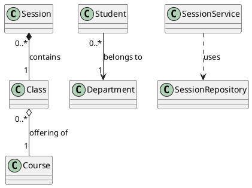

# UML Class Diagram Specification
## HCMUT Tutoring Support System - Complete UML Relationship Analysis

**Document Purpose:** Detailed UML class diagram specification with standard UML relationships  
**Generated:** November 25, 2025  
**UML Version:** 2.5 Standard

---

## UML Relationship Types Reference

| UML Relationship | Symbol | Meaning | When to Use |
|-----------------|---------|---------|-------------|
| **Association** | `────────>` | "uses" or "has" relationship | General structural connection |
| **Aggregation** | `◇────────>` | "has-a" (weak ownership) | Part can exist independently |
| **Composition** | `◆────────>` | "contains" (strong ownership) | Part cannot exist without whole |
| **Inheritance** | `────────▷` | "is-a" relationship | Subclass extends superclass |
| **Realization** | `- - - -▷` | "implements" relationship | Class implements interface |
| **Dependency** | `- - - - >` | "uses" temporarily | Uses as parameter/return type |

---

## Part 1: Entity Layer - Complete UML Relationships

### 1.1 User Hierarchy (Inheritance)

```
┌─────────────────────────────┐
│         <<entity>>          │
│           User              │
├─────────────────────────────┤
│ - userId: Integer           │
│ - email: String             │
│ - firstName: String         │
│ - middleName: String        │
│ - lastName: String          │
│ - userType: UserType        │
└─────────────────────────────┘
              △
              │ (shared PK)
      ┌───────┴────────┐
      │                │
      │                │
┌─────┴──────┐   ┌────┴────────┐
│  Student   │   │UniversityStaff│
└────────────┘   └──────────────┘
```

**UML Relationship Type:** **COMPOSITION** (One-to-One with shared primary key)

| From | To | Relationship | Multiplicity | Navigability | UML Notation | JPA Annotation |
|------|-----|--------------|--------------|--------------|--------------|----------------|
| `Student` | `User` | Composition | 1..1 → 1..1 | Bidirectional | `◆────────>` | `@OneToOne @MapsId` |
| `UniversityStaff` | `User` | Composition | 1..1 → 1..1 | Bidirectional | `◆────────>` | `@OneToOne @MapsId` |

**Justification:** Composition because:
- Student/Staff cannot exist without User
- Shared primary key enforces lifecycle dependency
- Deletion of User cascades to Student/Staff

**UML Diagram Code:**
```
Student "1" ◆────── "1" User
  {mandatory}

UniversityStaff "1" ◆────── "1" User
  {mandatory}
```

---

### 1.2 Department Relationships (Association)

```
         ┌─────────────┐
         │ Department  │
         └──────┬──────┘
                │
        ┌───────┼───────┐
        │       │       │
        ▼       ▼       ▼
    Student  Staff   Course
```

**UML Relationship Type:** **ASSOCIATION** (Many-to-One)

| From | To | Relationship | Multiplicity | Navigability | UML Notation | JPA Annotation |
|------|-----|--------------|--------------|--------------|--------------|----------------|
| `Student` | `Department` | Association | N → 1 | Unidirectional | `────────>` | `@ManyToOne` |
| `UniversityStaff` | `Department` | Association | N → 1 | Unidirectional | `────────>` | `@ManyToOne` |
| `Course` | `Department` | Association | N → 1 | Unidirectional | `────────>` | `@ManyToOne` |

**Justification:** Association (not Aggregation) because:
- Department can exist without Students/Staff/Courses
- Student/Staff/Course can theoretically change departments
- No whole-part lifecycle dependency

**UML Diagram Code:**
```
Student "0..*" ────────> "1" Department
  {navigable: from Student only}

UniversityStaff "0..*" ────────> "1" Department
  {navigable: from Staff only}

Course "0..*" ────────> "1" Department
  {navigable: from Course only}
```

---

### 1.3 Course-Class Relationship (Aggregation)

```
┌─────────────┐
│   Course    │  1
└──────┬──────┘
       │ ◇ (has many)
       │
       ▼
┌──────────────┐
│    Class     │  0..*
└──────────────┘
```

**UML Relationship Type:** **AGGREGATION** (One-to-Many)

| From | To | Relationship | Multiplicity | Navigability | UML Notation | JPA Annotation |
|------|-----|--------------|--------------|--------------|--------------|----------------|
| `Class` | `Course` | Aggregation | N → 1 | Unidirectional | `◇────────>` | `@ManyToOne` |

**Justification:** Aggregation because:
- Course is a "template" or "catalog entry"
- Class is a specific "offering" of the course
- Classes can be deleted without affecting Course definition
- Course "owns" multiple Class instances conceptually
- Weak ownership: Class instances are independent entities

**UML Diagram Code:**
```
Class "0..*" ◇────────> "1" Course
  {Class is specific offering of Course}
  {Class can exist independently}
```

---

### 1.4 UniversityStaff-Class Relationship (Association)

```
┌──────────────────┐
│ UniversityStaff  │  1
└────────┬─────────┘
         │ (teaches)
         │
         ▼
    ┌────────┐
    │ Class  │  0..*
    └────────┘
```

**UML Relationship Type:** **ASSOCIATION** (One-to-Many, role-based)

| From | To | Relationship | Multiplicity | Navigability | UML Notation | Role Name | JPA Annotation |
|------|-----|--------------|--------------|--------------|--------------|-----------|----------------|
| `Class` | `UniversityStaff` | Association | N → 1 | Unidirectional | `────────>` | `tutor` | `@ManyToOne` |

**Justification:** Association because:
- UniversityStaff acts as "tutor" role
- Class requires tutor assignment but staff can exist without classes
- No ownership relationship

**UML Diagram Code:**
```
Class "0..*" ────────> "1" UniversityStaff
  {role: tutor}
  {constraint: tutor cannot be null}
```

---

### 1.5 Class-Session Relationship (Composition)

```
┌─────────────┐
│    Class    │  1
└──────┬──────┘
       │ ◆ (owns)
       │
       ▼
┌──────────────┐
│   Session    │  0..*
└──────────────┘
```

**UML Relationship Type:** **COMPOSITION** (One-to-Many)

| From | To | Relationship | Multiplicity | Navigability | UML Notation | JPA Annotation |
|------|-----|--------------|--------------|--------------|--------------|----------------|
| `Session` | `Class` | Composition | N → 1 | Unidirectional | `◆────────>` | `@ManyToOne` |

**Justification:** Composition because:
- Session cannot exist without a parent Class
- Session lifecycle is tied to Class
- When Class is deleted, Sessions should be deleted (cascade)
- Strong whole-part relationship

**UML Diagram Code:**
```
Session "0..*" ◆────────> "1" Class
  {Session is part of Class}
  {Session cannot exist without Class}
  {cascade: DELETE}
```

---

### 1.6 Student-CourseRegistration-Class (Association Class Pattern)

```
┌──────────┐                        ┌──────────┐
│ Student  │                        │  Class   │
└────┬─────┘                        └────┬─────┘
     │                                   │
     │ N                             N   │
     │    ┌──────────────────────┐      │
     └────│ CourseRegistration   │──────┘
          ├──────────────────────┤
          │ - registrationId     │
          │ - registeredAt       │
          └──────────────────────┘
```

**UML Relationship Type:** **ASSOCIATION CLASS** (Many-to-Many with attributes)

| From | To | Relationship | Multiplicity | Navigability | UML Notation | JPA Annotation |
|------|-----|--------------|--------------|--------------|--------------|----------------|
| `CourseRegistration` | `Student` | Association | N → 1 | Unidirectional | `────────>` | `@ManyToOne` |
| `CourseRegistration` | `Class` | Association | N → 1 | Unidirectional | `────────>` | `@ManyToOne` |
| `CourseRegistration` | `Course` | Association | N → 1 | Unidirectional | `────────>` | `@ManyToOne` |

**Justification:** Association Class because:
- Represents "enrollment" relationship between Student and Class
- Has additional attributes (registrationId, registeredAt)
- Standard UML pattern for many-to-many with properties

**UML Diagram Code:**
```
Student "1" ────────> "0..*" CourseRegistration
Class "1" ────────> "0..*" CourseRegistration
Course "1" ────────> "0..*" CourseRegistration

{CourseRegistration is association class}
{Represents Student enrolled in Class}
```

---

### 1.7 Session-SessionEnrollment-Student (Association Class Pattern)

```
┌──────────┐                        ┌──────────┐
│ Student  │                        │ Session  │
└────┬─────┘                        └────┬─────┘
     │                                   │
     │ N                             N   │
     │    ┌──────────────────────┐      │
     └────│ SessionEnrollment    │──────┘
          ├──────────────────────┤
          │ - enrollmentId       │
          │ - enrollmentDate     │
          │ - status             │
          └──────────────────────┘
```

**UML Relationship Type:** **ASSOCIATION CLASS** (Many-to-Many with attributes)

| From | To | Relationship | Multiplicity | Navigability | UML Notation | Fetch Strategy | JPA Annotation |
|------|-----|--------------|--------------|--------------|--------------|----------------|----------------|
| `SessionEnrollment` | `Session` | Association | N → 1 | Unidirectional | `────────>` | LAZY | `@ManyToOne(fetch=LAZY)` |
| `SessionEnrollment` | `Student` | Association | N → 1 | Unidirectional | `────────>` | LAZY | `@ManyToOne(fetch=LAZY)` |

**Justification:** Association Class because:
- Represents "participation" relationship
- Has enrollment-specific attributes (date, status)
- LAZY fetch to avoid N+1 queries

**UML Diagram Code:**
```
Student "1" ────────> "0..*" SessionEnrollment
  {fetch: LAZY}

Session "1" ────────> "0..*" SessionEnrollment
  {fetch: LAZY}

{SessionEnrollment is association class}
{Represents Student participation in Session}
```

---

### 1.8 Feedback Relationships (Composition + Association)

```
┌──────────┐     ┌──────────┐     ┌──────────┐
│ Student  │     │  Course  │     │  Class   │
└────┬─────┘     └────┬─────┘     └────┬─────┘
     │                │                │
     │ N              │ N              │ N
     │                │                │
     │    ┌───────────┴────────┐      │
     └────│      Feedback      │──────┘
          ├────────────────────┤
          │ - feedbackId       │
          │ - comment          │
          │ - status           │
          └─────────┬──────────┘
                    │ ◆ (owns)
                    │ 1
                    ▼ 0..*
          ┌──────────────────┐
          │ FeedbackRating   │
          ├──────────────────┤
          │ - ratingId       │
          │ - question       │
          │ - ratingValue    │
          └──────────────────┘
```

**UML Relationship Types:**

| From | To | Relationship | Multiplicity | UML Notation | JPA Annotation |
|------|-----|--------------|--------------|--------------|----------------|
| `Feedback` | `Student` | Association | N → 1 | `────────>` | `@ManyToOne` |
| `Feedback` | `Course` | Association | N → 1 | `────────>` | `@ManyToOne` |
| `Feedback` | `Class` | Association | N → 1 | `────────>` | `@ManyToOne` |
| `Feedback` | `FeedbackRating` | **Composition** | 1 → N | `◆────────>` | `@OneToMany(cascade=ALL, orphanRemoval=true)` |

**Justification:**
- **Association** (Feedback → Student/Course/Class): Reference relationships
- **Composition** (Feedback → FeedbackRating): 
  - Ratings cannot exist without Feedback
  - Cascade ALL + orphan removal enforces strong ownership
  - Deleting Feedback deletes all Ratings

**UML Diagram Code:**
```
Feedback "0..*" ────────> "1" Student
Feedback "0..*" ────────> "1" Course
Feedback "0..*" ────────> "1" Class

Feedback "1" ◆────────> "0..*" FeedbackRating
  {cascade: ALL}
  {orphanRemoval: true}
  {FeedbackRating cannot exist independently}
```

---

### 1.9 Material Relationship (Aggregation)

```
┌──────────┐
│  Course  │  1
└────┬─────┘
     │ ◇ (contains)
     │
     ▼
┌──────────────┐
│  Material    │  0..*
└──────────────┘
```

**UML Relationship Type:** **AGGREGATION** (One-to-Many)

| From | To | Relationship | Multiplicity | Navigability | UML Notation | Fetch Strategy | JPA Annotation |
|------|-----|--------------|--------------|--------------|--------------|----------------|----------------|
| `Material` | `Course` | Aggregation | N → 1 | Unidirectional | `◇────────>` | LAZY | `@ManyToOne(fetch=LAZY)` |

**Justification:** Aggregation because:
- Material is "part of" Course resources
- Material can theoretically be moved/reused (weak ownership)
- Material lifecycle is somewhat independent
- Not Composition because materials could be archived separately

**UML Diagram Code:**
```
Material "0..*" ◇────────> "1" Course
  {Material is resource associated with Course}
  {fetch: LAZY}
```

---

### 1.10 ActivityLog Relationship (Dependency)

```
┌──────────────┐
│ ActivityLog  │
├──────────────┤
│ - userId     │ (integer, not FK)
│ - action     │
│ - entityType │
│ - entityId   │
└──────────────┘
       ┊
       ┊ (uses userId value)
       ┊
┌──────┴─────┐
│    User    │
└────────────┘
```

**UML Relationship Type:** **DEPENDENCY** (uses but no structural relationship)

| From | To | Relationship | Multiplicity | Navigability | UML Notation | Implementation |
|------|-----|--------------|--------------|--------------|--------------|----------------|
| `ActivityLog` | `User` | Dependency | N ⇢ 1 | None | `- - - ->` | Stores userId as integer (no FK) |

**Justification:** Dependency because:
- ActivityLog references User by ID only
- No JPA relationship (no `@ManyToOne`)
- Design choice for audit trail integrity
- User deletion should not delete logs

**UML Diagram Code:**
```
ActivityLog - - - -> User
  {uses userId}
  {no foreign key}
  {dependency for audit purposes}
```

---

## Part 2: Enum Associations

### 2.1 UserType Enum

```
┌────────────────┐        ┌─────────────┐
│      User      │───────>│  UserType   │
│                │  uses  │  <<enum>>   │
└────────────────┘        ├─────────────┤
                          │ STUDENT     │
                          │ TUTOR       │
                          │ ADMINISTRATOR│
                          │ COOPERATOR  │
                          └─────────────┘
```

**UML Relationship Type:** **ASSOCIATION** (uses enumeration)

**UML Diagram Code:**
```
User "0..*" ────────> "1" UserType
  {User.userType : UserType}
```

---

### 2.2 MaterialSourceType Enum

```
┌────────────────┐        ┌──────────────────┐
│   Material     │───────>│MaterialSourceType│
│                │  uses  │    <<enum>>      │
└────────────────┘        ├──────────────────┤
                          │ LOCAL_FILE       │
                          │ LIBRARY_REF      │
                          │ EXTERNAL_URL     │
                          └──────────────────┘
```

**UML Relationship Type:** **ASSOCIATION** (uses enumeration)

**UML Diagram Code:**
```
Material "0..*" ────────> "1" MaterialSourceType
  {Material.sourceType : MaterialSourceType}
```

---

## Part 3: Service Layer Relationships

### 3.1 Service-Repository Relationships (Dependency)

**UML Relationship Type:** **DEPENDENCY** (uses as instance variable)

All service classes depend on repositories:

```
┌──────────────────┐
│  ClassService    │
└────────┬─────────┘
         ┊ (depends on)
    ┌────┼────┬───────────┐
    ┊    ┊    ┊           ┊
    ▼    ▼    ▼           ▼
  ClassRepo CourseRepo StaffRepo ...
```

| Service | Repository Dependencies | UML Notation |
|---------|------------------------|--------------|
| `UserService` | `UserRepository` | `- - - ->` |
| `StudentService` | `StudentRepository`, `UserRepository` | `- - - ->` |
| `ClassService` | `ClassRepository`, `CourseRepository`, `UniversityStaffRepository`, `UserRepository`, `UserProfilePersistenceService` | `- - - ->` |
| `SessionService` | `jpaSessionRepository`, `ClassRepository`, `UniversityStaffRepository`, `UserRepository`, `StudentRepository`, `SessionRegistrationRepository`, `ActivityLogRepository` | `- - - ->` |
| `FeedbackService` | `FeedbackRepository`, `StudentRepository`, `CourseRepository`, `ClassRepository`, `CourseRegistrationRepository`, `ActivityLogRepository`, `UserRepository` | `- - - ->` |
| `MaterialService` | `MaterialRepository`, `CourseRepository`, `LibraryClient` | `- - - ->` |
| `CourseRegistrationService` | `CourseRegistrationRepository`, `ClassRepository`, `StudentRepository`, `UserRepository` | `- - - ->` |

**UML Diagram Code (Example: SessionService):**
```
SessionService - - - -> jpaSessionRepository
SessionService - - - -> ClassRepository
SessionService - - - -> StudentRepository
SessionService - - - -> UserRepository
SessionService - - - -> SessionRegistrationRepository
SessionService - - - -> ActivityLogRepository

{uses: field injection}
{dependency: instantiation}
```

---

### 3.2 Controller-Service Relationships (Dependency)

**UML Relationship Type:** **DEPENDENCY** (uses as instance variable)

All controllers depend on services:

```
┌──────────────────┐
│ SessionController│
└────────┬─────────┘
         ┊ (depends on)
         ▼
  ┌─────────────┐
  │SessionService│
  └─────────────┘
```

| Controller | Service Dependencies | UML Notation |
|-----------|---------------------|--------------|
| `AuthController` | `ToFEUserMapper` | `- - - ->` |
| `ClassController` | `ClassService` | `- - - ->` |
| `SessionController` | `SessionService` | `- - - ->` |
| `FeedbackController` | `FeedbackService` | `- - - ->` |
| `MaterialController` | `MaterialService` | `- - - ->` |
| `CourseController` | `CourseService`, `CourseRepository` | `- - - ->` |
| `CourseRegistrationController` | `CourseRegistrationService` | `- - - ->` |

**UML Diagram Code (Standard Pattern):**
```
<<RestController>>
SessionController - - - -> SessionService
  {uses: field injection}
  {instantiation dependency}
```

---

### 3.3 Service-DTO Relationships (Dependency)

**UML Relationship Type:** **DEPENDENCY** (uses as parameter/return type)

Services use DTOs but don't store them:

```
┌──────────────────┐
│  SessionService  │
│                  │
│ + createSession()│───uses───> CreateSessionRequest
│ + getSession()   │<──returns─ SessionResponse
└──────────────────┘
```

**UML Diagram Code:**
```
SessionService - - - -> CreateSessionRequest
  {uses: method parameter}

SessionService - - - -> SessionResponse
  {uses: method return type}
```

---

### 3.4 External Client Dependencies

#### MaterialService → LibraryClient

```
┌──────────────────┐
│ MaterialService  │
└────────┬─────────┘
         ┊ (depends on)
         ▼
  ┌─────────────┐
  │LibraryClient│
  └──────┬──────┘
         ┊ (calls)
         ▼
  HCMUT-LIBRARY
   (External API)
```

**UML Relationship Type:** **DEPENDENCY**

**UML Diagram Code:**
```
MaterialService - - - -> LibraryClient
  {uses: integration}

LibraryClient - - - -> HCMUT-LIBRARY
  {external system}
```

---

## Part 4: Complete UML Relationship Matrix

### Entity-to-Entity Relationships

| From Entity | To Entity | UML Type | Symbol | Multiplicity | Navigability | Cascade | Orphan Removal |
|------------|-----------|----------|--------|--------------|--------------|---------|----------------|
| `Student` | `User` | Composition | ◆─> | 1..1 → 1..1 | Bidirectional | - | - |
| `UniversityStaff` | `User` | Composition | ◆─> | 1..1 → 1..1 | Bidirectional | - | - |
| `Student` | `Department` | Association | ──> | N → 1 | Unidirectional | - | - |
| `UniversityStaff` | `Department` | Association | ──> | N → 1 | Unidirectional | - | - |
| `Course` | `Department` | Association | ──> | N → 1 | Unidirectional | - | - |
| `Class` | `Course` | Aggregation | ◇─> | N → 1 | Unidirectional | - | - |
| `Class` | `UniversityStaff` | Association | ──> | N → 1 | Unidirectional | - | - |
| `Session` | `Class` | Composition | ◆─> | N → 1 | Unidirectional | - | - |
| `CourseRegistration` | `Student` | Association | ──> | N → 1 | Unidirectional | - | - |
| `CourseRegistration` | `Class` | Association | ──> | N → 1 | Unidirectional | - | - |
| `CourseRegistration` | `Course` | Association | ──> | N → 1 | Unidirectional | - | - |
| `SessionEnrollment` | `Session` | Association | ──> | N → 1 | Unidirectional | - | - |
| `SessionEnrollment` | `Student` | Association | ──> | N → 1 | Unidirectional | - | - |
| `Feedback` | `Student` | Association | ──> | N → 1 | Unidirectional | - | - |
| `Feedback` | `Course` | Association | ──> | N → 1 | Unidirectional | - | - |
| `Feedback` | `Class` | Association | ──> | N → 1 | Unidirectional | - | - |
| `Feedback` | `FeedbackRating` | Composition | ◆─> | 1 → N | Bidirectional | ALL | true |
| `Material` | `Course` | Aggregation | ◇─> | N → 1 | Unidirectional | - | - |
| `User` | `UserType` | Association | ──> | N → 1 | - | - | - |
| `Material` | `MaterialSourceType` | Association | ──> | N → 1 | - | - | - |
| `ActivityLog` | `User` | Dependency | ┈─> | N ⇢ 1 | None | - | - |

---

## Part 5: UML Stereotype Usage

### Stereotypes for Classes

```
<<entity>>          - JPA Entity classes
<<enum>>            - Enumeration types
<<service>>         - Service layer classes
<<RestController>>  - REST API controllers
<<Repository>>      - JPA Repository interfaces
<<DTO>>             - Data Transfer Objects
<<Client>>          - External service clients
<<Configuration>>   - Spring configuration classes
```

### Example Usage in Diagram:

```
┌─────────────────────┐
│    <<entity>>       │
│       User          │
├─────────────────────┤
│ - userId: Integer   │
│ - email: String     │
└─────────────────────┘

┌─────────────────────┐
│     <<enum>>        │
│     UserType        │
├─────────────────────┤
│ STUDENT             │
│ TUTOR               │
│ ADMINISTRATOR       │
│ COOPERATOR          │
└─────────────────────┘

┌─────────────────────┐
│   <<service>>       │
│   UserService       │
├─────────────────────┤
│ + findByEmail()     │
│ + createUser()      │
└─────────────────────┘
```

---

## Part 6: Drawing Recommendations by Relationship Type

### When to Use Each Relationship:

1. **Composition (◆─>)** - Use when:
   - Child cannot exist without parent
   - Parent "owns" the child exclusively
   - Cascade delete applies
   - Examples: `Session ◆─> Class`, `FeedbackRating ◆─> Feedback`

2. **Aggregation (◇─>)** - Use when:
   - Child is "part of" parent but can exist independently
   - Weak ownership relationship
   - No cascade delete
   - Examples: `Class ◇─> Course`, `Material ◇─> Course`

3. **Association (──>)** - Use when:
   - General "uses" or "has" relationship
   - No ownership implied
   - Both entities have independent lifecycles
   - Examples: `Student ──> Department`, `Class ──> UniversityStaff`

4. **Dependency (┈─>)** - Use when:
   - Temporary "uses" relationship
   - Method parameter or return type
   - No structural relationship
   - Examples: `Service ┈─> Repository`, `Controller ┈─> Service`, `ActivityLog ┈─> User`

---

## Part 7: Complete UML Class Diagram Layers

### Layer 1: Core Domain Model (Entity Classes Only)

**Focus:** Entity classes with all relationships  
**Includes:** All 14 entities + 2 enums  
**Relationship Types:** Composition, Aggregation, Association

```
Recommended Layout:
- Top: User hierarchy (User, Student, UniversityStaff)
- Left: Department
- Center: Course, Class, Session
- Right: Registration entities
- Bottom: Feedback, Material, ActivityLog
```

---

### Layer 2: Service Architecture Diagram

**Focus:** Service classes and their dependencies  
**Includes:** Services, Repositories  
**Relationship Types:** Dependency only

```
Layout:
┌─────────────┐
│ Controllers │
└──────┬──────┘
       ┊ (depends)
┌──────▼──────┐
│  Services   │
└──────┬──────┘
       ┊ (depends)
┌──────▼──────┐
│Repositories │
└──────┬──────┘
       ┊
┌──────▼──────┐
│  Entities   │
└─────────────┘
```

---

### Layer 3: API Layer Diagram

**Focus:** Controllers, DTOs, Services  
**Includes:** Request/Response DTOs  
**Relationship Types:** Dependency

```
Layout:
<<RestController>>     <<DTO>>          <<service>>
SessionController ┈─> SessionRequest ┈─> SessionService
                  <┈─ SessionResponse
```

---

## Part 8: Constraint Notation

### UML Constraints to Include

```
{constraint notation}

Examples:

Student "0..*" ────────> "1" Department
  {mandatory}

Session "0..*" ◆────────> "1" Class
  {unique: class_id, start_time}
  {constraint: startTime < endTime}

Feedback "1" ◆────────> "0..*" FeedbackRating
  {cascade: ALL}
  {orphanRemoval: true}

Class "0..*" ────────> "1" UniversityStaff
  {role: tutor}
  {constraint: capacity >= enrolledCount}

FeedbackRating
  {constraint: ratingValue >= 1 AND ratingValue <= 5}
```

---

## Part 9: Package Diagram Organization

### Suggested Package Structure

```
┌────────────────────────────────────┐
│         org.minhtrinh              │
│       .hcmuttssbackend             │
├────────────────────────────────────┤
│                                    │
│  ┌──────────┐  ┌──────────┐      │
│  │  entity  │  │   dto    │      │
│  └────┬─────┘  └────┬─────┘      │
│       │             │             │
│       │             │             │
│  ┌────▼─────┐  ┌───▼──────┐     │
│  │repository│  │controller│     │
│  └────┬─────┘  └────┬─────┘     │
│       │             │             │
│       │        ┌────▼─────┐      │
│       └───────>│ service  │      │
│                └──────────┘      │
│                                    │
│  ┌──────────┐  ┌──────────┐      │
│  │  config  │  │  client  │      │
│  └──────────┘  └──────────┘      │
└────────────────────────────────────┘

Dependencies:
controller ┈─> service ┈─> repository ┈─> entity
controller ┈─> dto
service ┈─> dto
client ┈─> dto
```

---

## Part 10: Tool-Specific Notations

### For PlantUML:



### For Draw.io / Lucidchart:

- Composition: Filled diamond (◆) at parent end
- Aggregation: Hollow diamond (◇) at parent end
- Association: Simple arrow (─>)
- Dependency: Dashed arrow (┈─>)

### For Visual Paradigm:

- Use "Composition" relationship for strong ownership
- Use "Aggregation" relationship for weak ownership
- Use "Association" for general relationships
- Use "Dependency" for temporary usage

---

## Summary: Relationship Decision Tree

```
Does child exist independently of parent?
├─ NO ─> Is lifecycle tightly coupled?
│         └─ YES ─> COMPOSITION (◆)
│
├─ SOMEWHAT ─> Is it a "part-of" relationship?
│              └─ YES ─> AGGREGATION (◇)
│
└─ YES ─> Is there a structural connection?
          ├─ YES ─> ASSOCIATION (─>)
          └─ NO ─> DEPENDENCY (┈─>)
```

---

## Quick Reference Card

| Relationship | Filled Diamond | Hollow Diamond | Arrow | Dashed Line |
|--------------|----------------|----------------|-------|-------------|
| Composition | ✓ | | ✓ | |
| Aggregation | | ✓ | ✓ | |
| Association | | | ✓ | |
| Dependency | | | ✓ | ✓ |

**Multiplicity Examples:**
- `1` - Exactly one
- `0..1` - Zero or one
- `0..*` or `*` - Zero or more
- `1..*` - One or more
- `2..4` - Between 2 and 4

---

**Document Complete.**  
**Total Relationships Documented:** 25 entity relationships + service layer dependencies  
**UML Compliance:** UML 2.5 Standard  
**Ready for:** Visual diagramming in any UML tool
